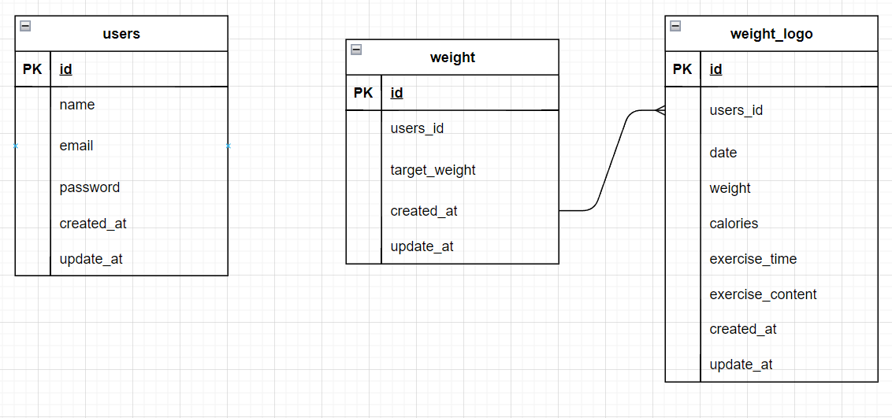

# PiGly

## 環境構築
**Dockerビルド**
* Dockerビルド
1. `git clone git@github.com:reika0513/weight_logs.git`
2. DockerDesktopアプリを立ち上げる
3. `docker-compose up -d-build`

MySQlは、OSによって起動しない場合があるのでそれぞれのPCに合わせてdocker-compose.ymlファイルを編集してください。

**Laravel環境構築**
1. `docker-compose exec php bash`
2. `composer install`
3. .env.exampleファイルから.envを作成し、以下の環境変数に変更

``` text
DB_CONNECTION=mysql
DB_HOST=mysql
DB_PORT=3306
DB_DATABASE=laravel_db
DB_USERNAME=laravel_user
DB_PASSWORD=laravel_pass
```
4. アプリケーションキーの作成
``` bash
php artisan key:generate
```

6. マイグレーションの実行
``` bash
php artisan migrate
```

7. シーディングの実行
``` bash
php artisan db:seed
```

## 使用技術(実行環境)
* php 8.3.13
* Laravel 8.83.29
* MySQL 8.0.26

## ER図


## URL
* 開発環境　[http://localhost/]
* phpMyAdmin　[http://localhost:8080/]